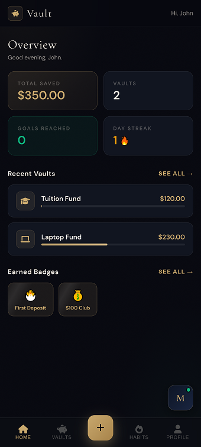
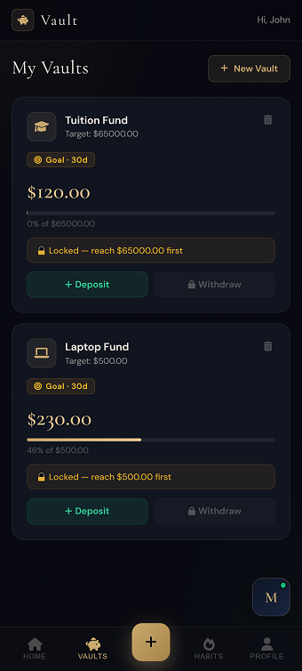
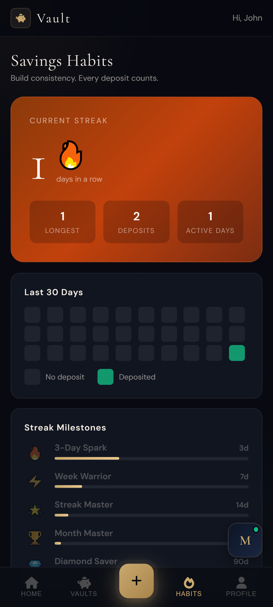
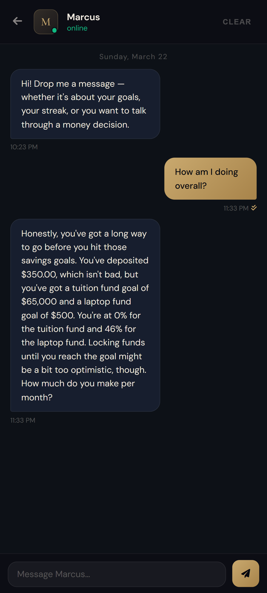

# 🏦 Vault — Smart Savings with AI Coaching

> *A premium savings app with goal-locked vaults, streak tracking, and Marcus — an AI financial advisor who gives you honest, personalised advice based on your actual numbers.*


---

## ✨ Features

- **Goal-based Vaults** — Create individual savings vaults for specific goals, each with its own target and progress tracking
- **Withdrawal Policies** — Lock your funds with customisable rules: free, goal-locked, cooling period, or both
- **Streak & Habit Tracking** — Daily deposit streaks, a 30-day activity calendar, milestones, and 12 unlockable badges
- **Marcus AI Advisor** — A WhatsApp-style chat with an AI advisor that knows your actual balances, goals, and streak
- **Goal Celebrations** — Confetti bursts and a celebration modal the moment you hit a savings target

---

## 📸 Screenshots

### Dashboard Overview


### Vault Management


### Habits & Streak Tracking


### Marcus — AI Financial Advisor


---

## 🛠️ Tech Stack

| Layer | Technology |
|---|---|
| Backend | Node.js + Express |
| Database | SQLite — `node:sqlite` (built-in, no install needed) |
| Auth | bcryptjs + express-session |
| AI Advisor | Groq API — Llama 3.1 8B Instant |
| Frontend | Vanilla HTML, CSS, JavaScript |
| Typography | Cormorant Garamond + DM Sans |
| Animations | canvas-confetti |
| Icons | Font Awesome 6 |

---

## 🚀 Getting Started

### Prerequisites
- Node.js **v22 or higher** (required for `node:sqlite`)
- A free [Groq API key](https://console.groq.com) for Marcus (optional — the rest of the app works without it)

### Installation

```bash
# 1. Clone the repository
git clone https://github.com/LaplaceMkhabela/Vault.git
cd vault

# 2. Install dependencies
npm install

# 3. Set environment variables
# Windows (Command Prompt)
set SESSION_SECRET=your-long-random-secret
set GROQ_API_KEY=gsk_your_groq_key_here

# Mac / Linux
export SESSION_SECRET=your-long-random-secret
export GROQ_API_KEY=gsk_your_groq_key_here

# 4. Start the server
npm start
```

Then open **http://localhost:3000** in your browser.

For live-reload during development:
```bash
npm run dev
```

---

## 🔑 Environment Variables

| Variable | Required | Description |
|---|---|---|
| `SESSION_SECRET` | Recommended | Secret key for session encryption. Defaults to a dev value if not set. |
| `GROQ_API_KEY` | Optional | Enables Marcus the AI advisor. Get a free key at [console.groq.com](https://console.groq.com). |
| `DB_PATH` | Optional | Custom path for the SQLite database file. Defaults to `./piggybank.db`. |
| `PORT` | Optional | Port to run the server on. Defaults to `3000`. |

---

## 🗄️ Database

Vault uses **SQLite** via Node's built-in `node:sqlite` module — no installation, no compilation, no external service required. The database file (`piggybank.db`) is created automatically on first run.

### Schema

```
users           — id, name, email, password_hash, created_at
piggy_banks     — id, user_id, name, icon, goal, balance,
                  withdrawal_policy, cooling_days, created_at
transactions    — id, bank_id, type, amount, date
```

### Key design decisions
- All balance updates use atomic `BEGIN/COMMIT` transactions — no partial writes on crash
- Deleting a vault cascades to all its transactions automatically
- WAL journal mode enabled for better read performance

### Backup
```bash
cp piggybank.db piggybank.backup.db
```

### Browse data
```bash
sqlite3 piggybank.db
.tables
SELECT name, balance, goal FROM piggy_banks;
SELECT type, amount, date FROM transactions ORDER BY date DESC LIMIT 20;
```

---

## 🔒 Withdrawal Policies

One of Vault's defining features. Set when creating a vault — enforced server-side on every withdrawal attempt.

| Policy | Behaviour |
|---|---|
| **Free** | Withdraw anytime, no restrictions |
| **Goal-locked** | Funds inaccessible until balance ≥ target |
| **Cooling period** | Locked for 7 days to 1 year from creation date |
| **Goal + Cooling** | Both conditions must be satisfied simultaneously |

---

## 🤖 Marcus — AI Advisor

Marcus is powered by **Llama 3.1 8B Instant** via the Groq API. Before every response, the server injects the user's live data into the system prompt:

- All vault names, balances, and goal progress
- Current and longest savings streak
- Total deposits made and total saved
- Withdrawal policies per vault

This means Marcus always gives advice based on your *actual* situation — not generic financial tips.

To enable Marcus, set your `GROQ_API_KEY` environment variable. Without it, the rest of the app works fully — Marcus simply won't respond.

---

## 📁 Project Structure

```
vault/
├── server.js          # Express app + all API route handlers
├── db.js              # SQLite data layer
├── piggybank.db       # Auto-created on first run (gitignored)
├── package.json
└── public/
    ├── page_1.html    # Landing page
    ├── page_2.html    # How It Works
    ├── page_3.html    # Security & Control
    ├── page_4.html    # Sign Up
    ├── page_5.html    # Login
    ├── dashboard.html # Protected SPA dashboard
    └── img/
        ├── 01-landing.png
        ├── 02-dashboard.png
        ├── 03-vaults.png
        ├── 04-habits.png
        └── 05-marcus.png
```

---

## 🌐 API Reference

### Auth
| Method | Endpoint | Description |
|---|---|---|
| `POST` | `/api/register` | Create a new account |
| `POST` | `/api/login` | Authenticate |
| `POST` | `/api/logout` | Destroy session |
| `GET` | `/api/me` | Get current user |

### Vaults *(auth required)*
| Method | Endpoint | Description |
|---|---|---|
| `GET` | `/api/piggybanks` | List all vaults |
| `POST` | `/api/piggybanks` | Create a vault |
| `POST` | `/api/piggybanks/:id/deposit` | Deposit funds |
| `POST` | `/api/piggybanks/:id/withdraw` | Withdraw funds (policy enforced) |
| `DELETE` | `/api/piggybanks/:id` | Delete a vault |

### Stats & Gamification *(auth required)*
| Method | Endpoint | Description |
|---|---|---|
| `GET` | `/api/stats` | Streaks, totals, 30-day activity map |
| `GET` | `/api/badges` | All 12 badges with earned status |

### Advisor *(auth required + GROQ_API_KEY)*
| Method | Endpoint | Description |
|---|---|---|
| `POST` | `/api/advisor/chat` | Chat with Marcus |

---


## 📄 Licence

MIT — free to use, modify, and distribute.

---

*Built for the HackEconomics Hackathon*
